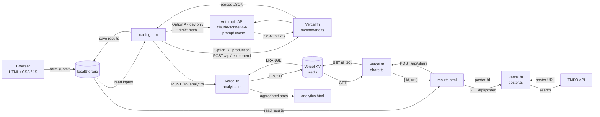

# CineMatch

A personalized movie recommendation web app. Three questions → six tailored film picks with spoiler-free explanations, powered by Claude.

**Live demo:** https://cinematch-navy.vercel.app

**GitHub:** https://github.com/jeffzh4/Cinematch

---

## How it works

1. User answers up to six questions on the form (three required, three optional filters)
2. Inputs are sent to a serverless function that calls Claude's API with prompt caching
3. Claude returns 6 films + a literary headline as structured JSON
4. Results page renders the films and fetches poster art from TMDB
5. Users can share their list via a short link (stored in Vercel KV, 30-day TTL)
6. Every recommendation is anonymously logged to Vercel KV for the analytics dashboard
7. Errors at any step fall through to a dedicated error page

## Pages

| File | Purpose |
|---|---|
| `index.html` | Landing |
| `form.html` | Six-question input form (3 required + 3 optional filters) |
| `loading.html` | Calls the recommendation API |
| `results.html` | Renders Claude's response + TMDB posters + share button |
| `share.html` | Read-only shared results card (`?id=xxx`) |
| `analytics.html` | Usage dashboard (genre breakdown, moods, occasions) |
| `error.html` | Fallback when API calls fail |
| `404.html` | Custom page-not-found |
| `about.html`, `contact.html` | Static info pages |

## Serverless functions (Vercel)

| Endpoint | Purpose |
|---|---|
| `POST /api/recommend` | Proxies Anthropic API — accepts `{ mood, genres, occasion, runtime?, decade?, platforms? }`, returns Claude's parsed JSON |
| `GET /api/poster?title=X&year=Y` | Proxies TMDB — returns poster URL for a film |
| `POST /api/analytics` | Logs anonymised recommendation entry to KV |
| `GET /api/analytics` | Returns aggregated stats (totals, genre counts, recent moods) |
| `POST /api/share` | Stores a result set in KV, returns `{ id, url }` |
| `GET /api/share?id=X` | Retrieves stored results by ID |

All functions are written in TypeScript. Keys are read from environment variables — **never in source.**

---

## Architecture



---

## Local development

Two options:

### Option A — Simple (direct API calls from browser)

1. Copy your Anthropic + TMDB keys into `config.local.js`:
   ```js
   window.CINEMATCH_CONFIG = {
     ANTHROPIC_API_KEY: 'sk-ant-...',
     ANTHROPIC_MODEL:   'claude-sonnet-4-6',
     TMDB_API_KEY:      '...'
   };
   ```
   (`config.local.js` is gitignored.)

2. Serve the directory:
   ```
   python3 -m http.server 7821
   ```

3. Open <http://localhost:7821>

> **Note:** Analytics logging and share links require Vercel KV and only work in Option B / production.

### Option B — With serverless functions (matches production)

1. Install Vercel CLI: `npm i -g vercel`
2. Create `.env.local`:
   ```
   ANTHROPIC_API_KEY=sk-ant-...
   TMDB_API_KEY=...
   KV_REST_API_URL=...
   KV_REST_API_TOKEN=...
   ```
3. Run `vercel dev`
4. Open the URL it prints

---

## Deploying to Vercel

1. Push this repo to GitHub
2. Go to [vercel.com](https://vercel.com), sign in, **Add New → Project**, import the repo
3. In **Project Settings → Environment Variables**, add:
   - `ANTHROPIC_API_KEY` — your Anthropic API key
   - `TMDB_API_KEY` — your TMDB API key
   - `ANTHROPIC_MODEL` _(optional)_ — defaults to `claude-sonnet-4-6`
4. Click **Deploy**

### Setting up Vercel KV (for analytics + share links)

1. In your Vercel project dashboard, go to **Storage → Create Database → KV**
2. Connect the KV store to your project
3. Vercel automatically adds `KV_REST_API_URL` and `KV_REST_API_TOKEN` to your environment variables
4. Redeploy — analytics logging and share links will start working immediately

The static HTML files and `api/` serverless functions are detected automatically — no build step required.

---

## Tech

- Plain HTML/CSS/JS — no framework, no build step
- TypeScript for all Vercel serverless functions
- Claude (`claude-sonnet-4-6`) with prompt caching for recommendations
- TMDB for poster art
- Vercel KV (Redis) for analytics and share links
- Vercel for hosting + serverless functions

→ See [CASE_STUDY.md](./CASE_STUDY.md) for technical decisions and lessons learned.

Built by Jeffrey Zhang, 2026.
