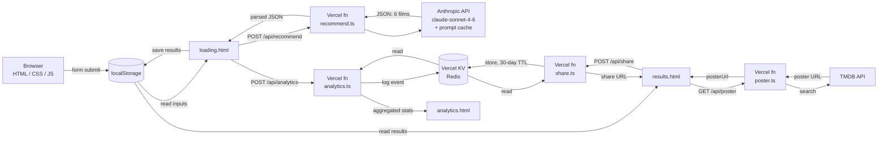

# CineMatch

CineMatch is a movie recommendation product that replaces browsing with a single decision point: answer three questions, receive six curated picks with spoiler-free rationale. It targets the choice-fatigue problem inherent to modern streaming catalogs — more titles, worse discovery.

**Live:** https://cinematch-navy.vercel.app
**Repository:** https://github.com/jeffzh4/Cinematch

---

## Product Summary

| | |
|---|---|
| **Problem** | Streaming discovery UIs optimize for engagement, not decision quality. Users spend more time browsing than watching. |
| **Solution** | A three-question intake (mood, genre, occasion) converted into a structured LLM prompt, returning six ranked recommendations with individual justifications. |
| **Differentiator** | Recommendation reasoning is generated per-user, not retrieved from a static catalog — output reflects the specific input, not a genre-matched template. |

### How it works

1. User completes a three-question intake; three additional filters (runtime, decade, platform) are optional.
2. Input is sent to a serverless endpoint that constructs a prompt and calls the Claude API.
3. Claude returns six films and a headline as structured JSON.
4. The results view renders the films and resolves poster art via TMDB.
5. Results can be shared via a generated link (stored with a 30-day retention window) or reviewed in an aggregate usage dashboard.
6. Failure states — malformed input, upstream API errors, missing data — route to a dedicated error page rather than failing silently.

---

## Product Surface

| Page | Function |
|---|---|
| `index.html` | Landing |
| `form.html` | Intake — three required questions, three optional filters |
| `loading.html` | Recommendation request in flight |
| `results.html` | Recommendation output, poster art, share action |
| `share.html` | Read-only view of a shared result set (`?id=`) |
| `analytics.html` | Aggregate usage dashboard — genre distribution, mood/occasion trends |
| `error.html` | Failure state |
| `404.html` | Not-found state |
| `about.html`, `contact.html` | Supporting pages |

## API Surface

| Endpoint | Function |
|---|---|
| `POST /api/recommend` | Accepts `{ mood, genres, occasion, runtime?, decade?, platforms? }`, returns structured recommendation JSON |
| `GET /api/poster?title=&year=` | Resolves poster art via TMDB |
| `POST /api/analytics` | Logs an anonymized usage event |
| `GET /api/analytics` | Returns aggregated usage statistics |
| `POST /api/share` | Persists a result set, returns a share link |
| `GET /api/share?id=` | Retrieves a persisted result set |

All endpoints are implemented in TypeScript. Credentials are read from server-side environment variables only; no key material is present in client-served code.

---

## Architecture


```mermaid
flowchart LR
    Browser["Browser\nHTML / CSS / JS"] -->|"form submit"| LS[(localStorage)]
    LS -->|"read inputs"| Loading["loading.html"]

    Loading -->|"POST /api/recommend"| VFR["Vercel fn\nrecommend.ts"]
    VFR --> Anthropic["Anthropic API\nclaude-sonnet-4-6\n+ prompt cache"]
    Anthropic -->|"JSON: 6 films"| VFR
    VFR -->|"parsed JSON"| Loading

    Loading -->|"save results"| LS
    Loading -->|"POST /api/analytics"| VFA["Vercel fn\nanalytics.ts"]
    VFA -->|"log event"| KV[(Vercel KV\nRedis)]

    LS -->|"read results"| Results["results.html"]
    Results -->|"GET /api/poster"| VFP["Vercel fn\nposter.ts"]
    VFP -->|"search"| TMDB["TMDB API"]
    TMDB -->|"poster URL"| VFP
    VFP -->|"posterUrl"| Results

    Results -->|"POST /api/share"| VFS["Vercel fn\nshare.ts"]
    VFS -->|"store, 30-day TTL"| KV
    VFS -->|"share URL"| Results

    KV -->|"read"| VFS
    KV -->|"read"| VFA
    VFA -->|"aggregated stats"| Analytics["analytics.html"]
```

The application has no database and no user accounts. State is either client-side (`localStorage`, single session) or ephemeral server-side (Vercel KV, time-bounded). This keeps operational surface area minimal — no schema migrations, no auth layer, no persistent user data to secure.

---

## Local Development

1. Install the Vercel CLI: `npm i -g vercel`
2. Create `.env.local`:
   ```
   ANTHROPIC_API_KEY=sk-ant-...
   TMDB_API_KEY=...
   KV_REST_API_URL=...
   KV_REST_API_TOKEN=...
   ```
3. Run `vercel dev` and open the printed URL.

Local development uses the same serverless proxy path as production — no separate dev-only code branch.

---

## Deployment

1. Push the repository to GitHub.
2. In Vercel, import the repository as a new project.
3. Set environment variables: `ANTHROPIC_API_KEY`, `TMDB_API_KEY`, and optionally `ANTHROPIC_MODEL` (defaults to `claude-sonnet-4-6`).
4. Deploy. Static assets and serverless functions are detected automatically — no build configuration required.

### Vercel KV (required for analytics and share links)

1. In the Vercel dashboard: **Storage → Create Database → KV**, connect it to the project.
2. `KV_REST_API_URL` and `KV_REST_API_TOKEN` are added automatically.
3. Redeploy.

---

## Stack

- HTML/CSS/vanilla JS on the client — no framework, no build step
- TypeScript for all serverless functions
- Claude (`claude-sonnet-4-6`) with prompt caching for recommendation generation
- TMDB for poster art resolution
- Vercel KV (Redis) for analytics and share-link storage
- Vercel for hosting and serverless compute

See [CASE_STUDY.md](./CASE_STUDY.md) for the reasoning behind these choices, including trade-offs and what would change in a v2.

Built by Jeffrey Zhang, 2026.
